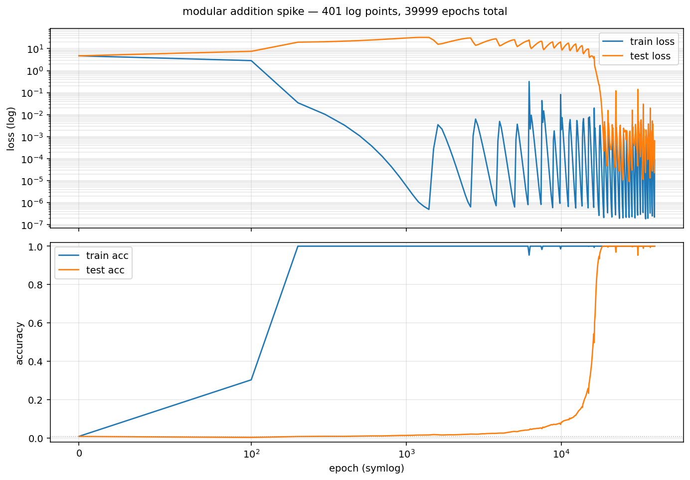

# Transformer Rooms

> **An interactive lab where you build a 1-layer transformer by hand, watch it suddenly _grok_ modular addition, and re-derive Nanda et al.'s Fourier circuits — all from inside painted rooms.**



*The grokking phenomenon: the model fits the training set early but only generalises ~40,000 epochs later, when the Fourier circuits crystallise.*

---

## What it is

`transformer-rooms` is a point-and-click adventure inspired by *Machinarium*, *The Witness*, and *Distill.pub* — but instead of solving puzzles, you build the parts of a transformer one room at a time. By the final room (the Fourier Wing), the painted motifs you've been walking past — number rings, nested wheels, sacred geometry tilework — turn out to be the actual Fourier circuits the model is using internally.

The model is the exact configuration from **Neel Nanda et al., "Progress measures for grokking via mechanistic interpretability" (2023)** — `(a + b) mod 113`, 1 layer, attention + MLP, no LayerNorm, trained until grokking. Reaching grokking reproduces the paper's central finding.

This is a portfolio piece exploring three things I care about together:
1. **Mechanistic interpretability** — making the inside of a transformer legible.
2. **Manipulable mathematics** (Bret Victor / Distill.pub tradition) — math you can push on, not just read.
3. **Painted, deliberate UX** — clockpunk + ink-and-color-wash, no twitch, ~10–15 minutes per room.

## Status

Active development. As of 2026-05:
- ✅ Backend: PyTorch + TransformerLens model loader, forward/probe executors, REST API (`/forward`, `/probe`, `/checkpoint/{step}`), comprehensive tests, MPS/CPU parity verified.
- ✅ Training: full grokking run completed, 6 checkpoints (steps 0 / 1k / 5k / 10k / 18k / 39,999) exported, spike-curve metrics captured for two runs.
- ✅ Frontend: 8 rooms scaffolded as SvelteKit routes — Embedding Garden, Hall of Memory, Attention Hall, MLP Forge, Unembedding Tower, Grokking Bell, Fourier Wing (with sub-scenes), Math Antechamber.
- ✅ Math primitives: dot product, matrix×vector, vector, sin/cos, unit circle — interactive Svelte components.
- ✅ Primer interactions: activation patching, cross-entropy, logits, softmax, weight decay — atomic explainables.
- 🚧 Polish, narrative voice, Grokking Bell live-training stretch goal.

## Tech stack

| Layer | Stack |
|-------|-------|
| Frontend | SvelteKit (Svelte 5), TypeScript, SVG + Canvas, Motion One |
| Backend | FastAPI, PyTorch, TransformerLens (`HookedTransformer`) |
| Training | AdamW, full-batch GD, weight_decay=1.0, 40,000 epochs (Nanda config exactly) |
| State | localStorage (no auth, no backend persistence) |
| Tests | vitest (frontend), pytest (backend) |

## Try it locally

```bash
# Backend (Python + PyTorch)
cd backend
uv sync
uv run uvicorn transformer_rooms.api:app --reload    # localhost:8000
# Pre-trained checkpoints ship in the repo — no GPU required for inference.
# To re-run training: uv run python train_spike.py

# Frontend (SvelteKit)
cd frontend
pnpm install
pnpm dev    # localhost:5173
```

Open `http://localhost:5173` and start in the Embedding Garden.

## Architecture & design

Four documents capture the locked design — pre-PRD level rigour:

- **[`DESIGN.md`](DESIGN.md)** — eight locked design decisions, pedagogical on-ramp rationale, validated milestones (grokking reproduced, art style validated, MPS parity), and architectural anchors for contributors.
- **[`research.md`](research.md)** — Nanda config verification, model spec derivation, the five canonical frequencies (k ∈ {14, 35, 41, 42, 52}) and why each one becomes a visual motif planted across rooms 1–4.
- **[`calibration.md`](calibration.md)** — Day-1-Player knowledge calibration: five-tier comfort survey that drove the decision to add a Level 0 Math Antechamber and shaped each room's just-in-time primer.
- **[`docs/math-antechamber-design.md`](docs/math-antechamber-design.md)** — Math primer room design: pedagogical scaffolding before the conceptual rooms.

## Visual language

Painted ink-and-color-wash, deep teal + warm brass + ivory off-white palette, 3/4 architectural interior view, no text, no logos. All `/art` generations share this style prefix so rooms feel of-a-piece. The recurring motifs (number ring, nested wheels, light beams, tilework) are planted in rooms 1–4 and retroactively explained in the Fourier Wing as the literal structure of the model's learned circuit.

References:
- **[Machinarium](https://amanita-design.net/machinarium/)** — painted-scene point-and-click, no avatar.
- **[The Witness](https://www.thewitnesspuzzle.com/)** — puzzles ARE the learning.
- **[Distill.pub](https://distill.pub/)** — manipulable mathematics, especially circuits work.
- **[TransformerLens](https://transformerlensorg.github.io/TransformerLens/)** — the library that makes this kind of intervention possible.
- **Nanda, N., Chan, L., Lieberum, T., Smith, J., & Steinhardt, J. (2023).** *Progress measures for grokking via mechanistic interpretability.* arXiv:2301.05217.

## License

MIT (pending file commit).

---

*Built as a personal experiment in pedagogy + mechinterp. If you stumble in via the Fourier Wing and want to chat about circuits, my contact is on my [GitHub profile](https://github.com/ugiya).*
